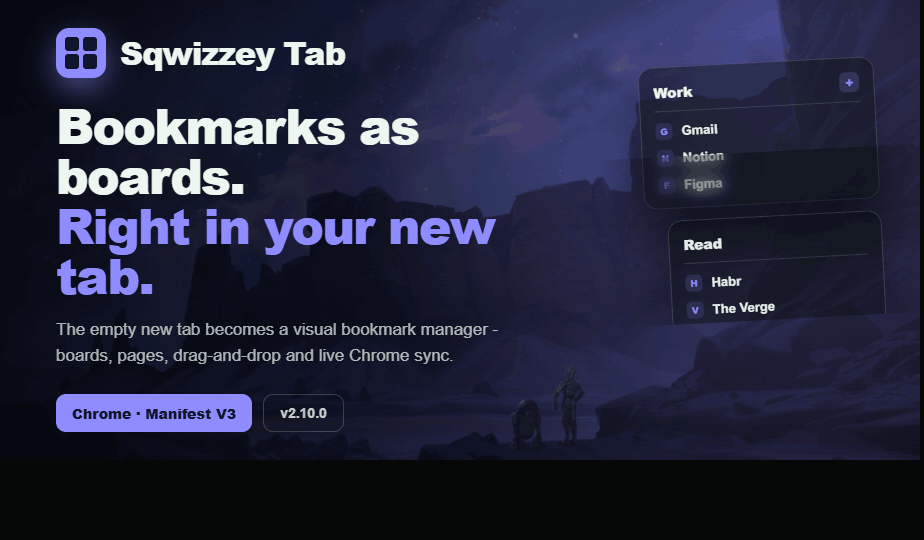
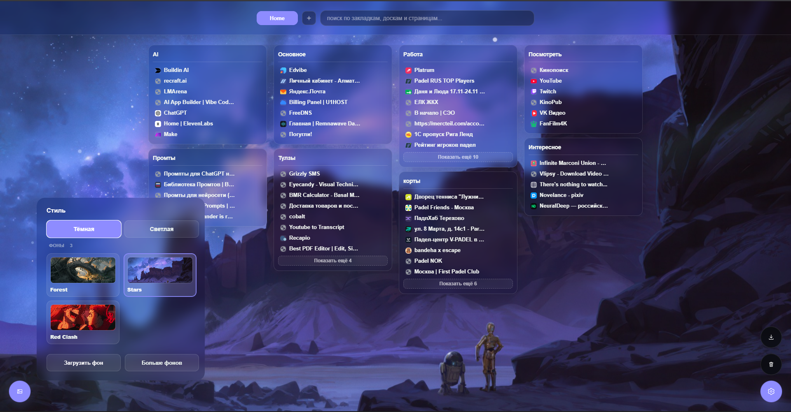
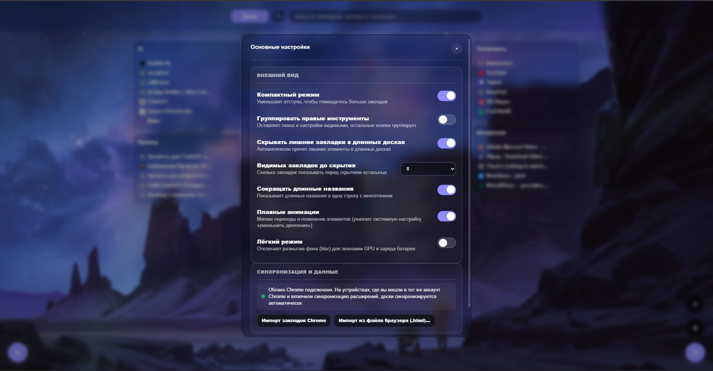
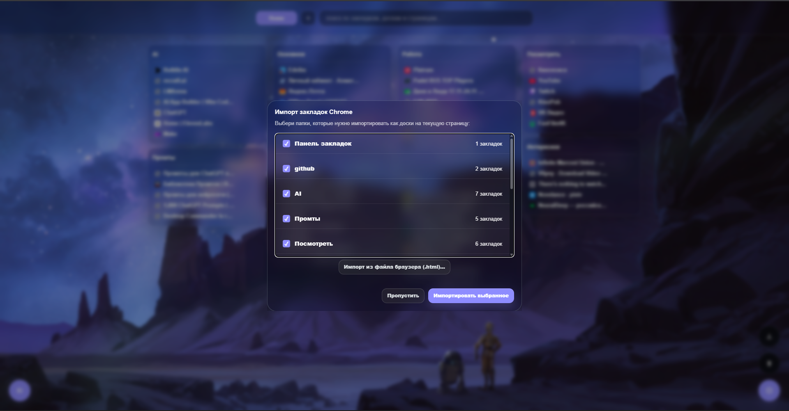

  

<h1 align="center">Sqwizzey Tab</h1>

  A new-tab replacement for Chrome - a visual bookmark manager with boards, pages, drag-and-drop and live Chrome bookmark-folder sync.
   
  <b>English</b> · <a href="README.ru.md">Русский</a>

## How it works

1. **Open a new tab** - your bookmarks show up as boards instead of an empty page. A Chrome bookmark folder becomes a board.
2. **Organize by dragging** - move boards between columns and links between boards; everything saves automatically and syncs through your Chrome account.
3. **Make it yours** - pick a theme, wallpaper and accent color; the accent is auto-derived from the wallpaper or set by hand.

## Screenshots

  

  
  

## Features

- **Boards** - each Chrome bookmark folder becomes a board; always a 4-column round-robin layout
- **Pages** - separate spaces (work, study, personal), each with its own boards
- **Drag-and-drop** - reorder links inside a board and move boards between columns
- **Live Chrome sync** - new bookmarks (Ctrl+D) land in the matching board automatically while the tab is open
- **Import** - from Chrome folders or a browser bookmarks `.html` file (Firefox, Edge, Opera, Safari, Chrome)
- **Themes** - dark / light, built-in wallpapers or your own image, background dimming, custom accent color
- **Trash** - restore deleted boards, links and pages for 30 days; an undo toast right after delete
- **Search** - instant, across bookmarks, boards and pages
- **Light mode** for the UI, optional animations (respects "reduce motion"), compact density, low-power mode (no blur)
- **Export / import** your whole setup as a single JSON file
- Data stays local and syncs through `chrome.storage.sync`

## Install

Not on the Chrome Web Store yet. To run the unpacked extension:

1. Clone or download this repository.
2. Open `chrome://extensions` and turn on **Developer mode** (top-right).
3. Click **Load unpacked** and select the project folder.
4. Open a new tab.

## Tech stack

Vanilla JS · CSS · HTML · Chrome Extension Manifest V3

## Design

Project rules (buttons, centering, glass, scrollbars) live in [DESIGN.md](DESIGN.md).
