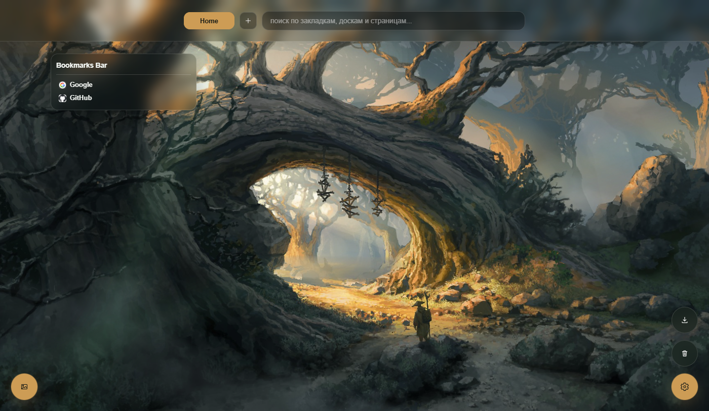

<p align="center">
  
</p>

<h1 align="center">Sqwizzey Tab</h1>

<p align="center">
  A new-tab replacement for Chrome — a visual bookmark manager with boards, pages and drag-and-drop.
  <br>
  <b>English</b> · <a href="README.ru.md">Русский</a>
</p>

## How it works

1. **Open a new tab** — your bookmarks show up as boards laid out in four columns, on top of a wallpaper.
2. **Organize by dragging** — move links between boards and boards between columns; add pages to group boards by context.
3. **Stay in sync** — boards mirror your Chrome bookmark folders live, and settings sync across devices through your Google account.
4. **Make it yours** — pick a theme, wallpaper, board opacity and blur in the style panel, with a live preview.

## Screenshot

<p align="center">
  
</p>

## Features

- Multiple pages, each with boards of bookmarks in a stable four-column layout
- Drag-and-drop of links between boards and boards between columns
- **Live Chrome bookmark sync** — a folder maps to a board; new bookmarks (Ctrl+D) land in the matching board automatically
- Cross-device settings sync via Google account (local-first with debounced cloud writes)
- Import bookmarks from Chrome or from another browser's exported `.html` (Firefox, Edge, Opera, Safari)
- Dark and light themes, custom wallpapers (built-in or your own via IndexedDB)
- Adjustable board opacity and blur, accent color, optional animations (respects reduced-motion)
- Trash with 30-day restore · JSON export/import · undo toast after deletions
- **Light mode** — turns off backdrop blur to save GPU and battery

## Install

This extension is distributed as an unpacked build (no store listing):

1. Open `chrome://extensions` and enable **Developer mode**.
2. Click **Load unpacked** and select this repository folder.
3. Open a new tab — Sqwizzey Tab takes over.

Works in Chrome and Brave. On Chrome 137+ the `--load-extension` command-line flag is restricted; load through the Extensions page as above.

## Development

Vanilla JS/CSS/HTML with no bundler — edit the files and reload the extension:

```
newtab.html / newtab.js   :: the new-tab page and its logic
styles.css                :: all styling (single file)
shared.js                 :: storage + sync helpers, shared with the popup
popup.html / popup.js     :: the toolbar popup
manifest.json             :: MV3 manifest (bump the version here)
```

After editing, press the reload icon on the extension card in `chrome://extensions`. See [DESIGN.md](DESIGN.md) for the project's design rules (buttons, centering, scrollbars) and [CHANGELOG.md](CHANGELOG.md) for the version history.

## Tech stack

Vanilla JavaScript · CSS · HTML · Chrome Extension MV3 · `chrome.storage` / `chrome.bookmarks` · IndexedDB
